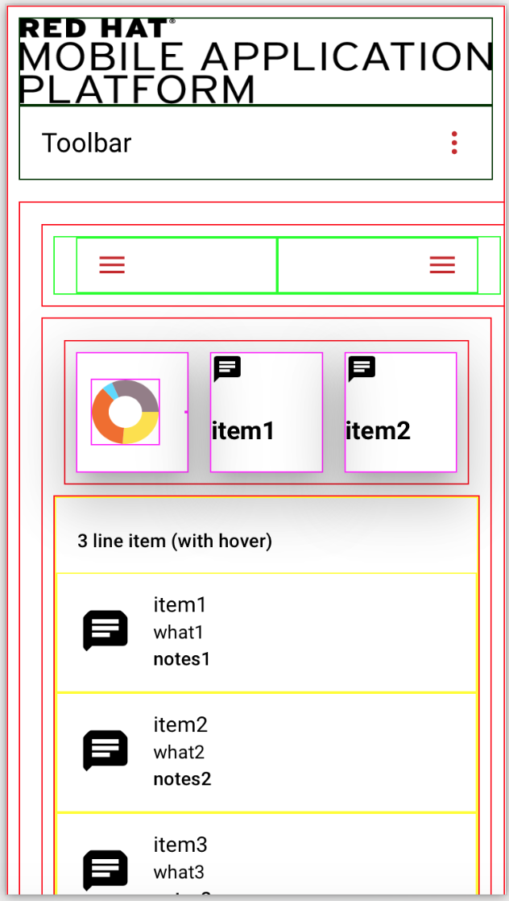
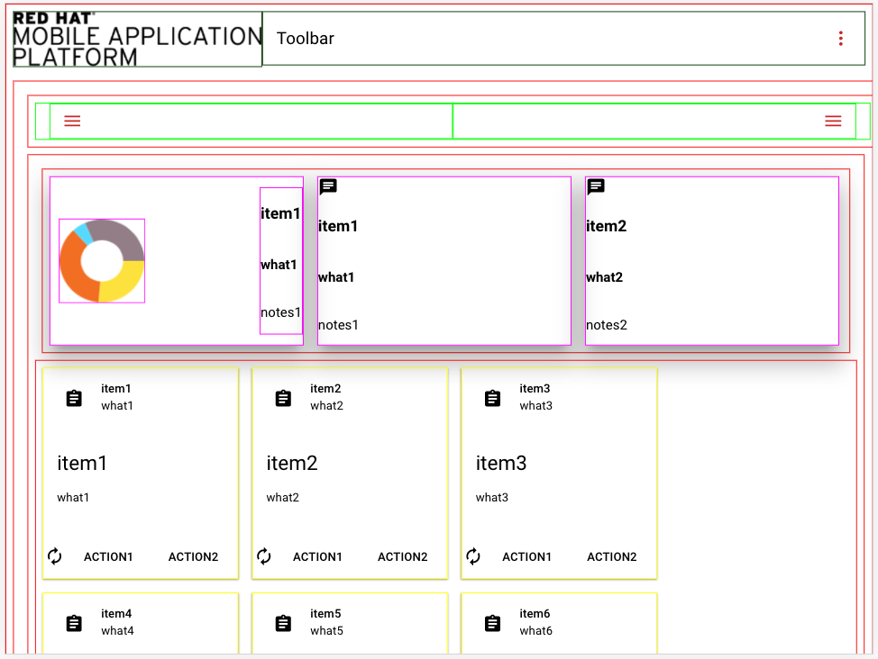
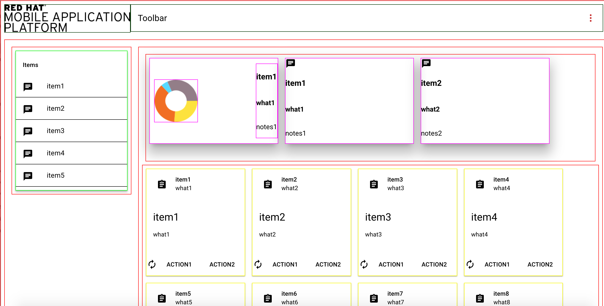

# md-boilerplate

This is a project that provides a boilerplate for mobile
apps designed with Angular Material Design. The app is responsive to fit different screen sizes.
It consists of modules that can be added or removed from the basic view. The modules include: a toolbar with a
logo that can be replaced, a left sidenav, an analytics panel with a piechart. A choice between a card layout, form
or a list for the main application screen.

