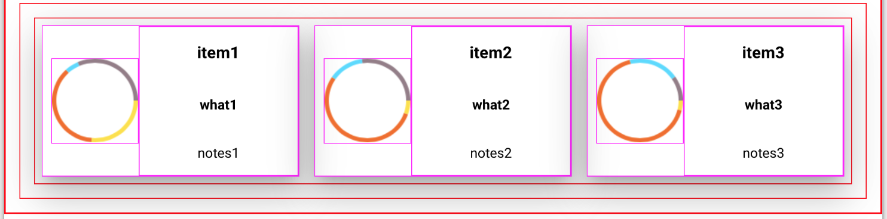
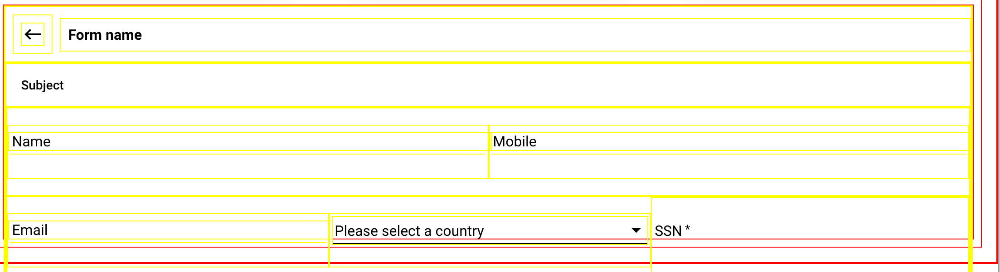

# md-boilerplate
Designing user friendly, nice looking and responsive user interfaces is a challenging and time consuming task.
In this demo I have used Angular Materal (below refered to as AM) and created a foundation which makes it simple to quickly build responsive user interfaces for use with Red Hat MAP. The design is primarily intended for B2E apps, but could
certainly also be used for business related B2C apps.
To make it easier to see the structure of the user interface elements, I have added a class with a different border color
to the different modules as follows:
```
Red: Main view
Dark Green: Toolbar
Green: Sidenav
Magenta: Analytics
Yellow: Card, List, Form - These three are mutually exclusive.
```
The different components can be shown or hidden by changing a corresponding scope variable in `view.controller.js`.
This simplifies debugging problems in the layout.

## Layout
The layout framework in AM is based on rows and columns and the layout attribute is applied to the parent container.
For example a `<div layout="row">` will make all child elements align in a row. In addition there are several alignment
attributes that is applied to the parent container and will affect the child elements (examples).
### View Layout
The View component is the parent component to the other components. It has a column layout with the layout-fill attribute
which makes its child elements horizontally fill the space created by the parent.


The topmost element in the View component consists of two immediate children: one for the toolbar and one for the remaining
elements. Both children contain the flex attribute.
The `flex`attribute is applied to the child elements to make them stretch horizontally in the space created by the parent.
Aligning elements in a row depends on this when the width of the display changes.
The component containing the remaining components (Sidenav, Analytics, List, Form, Card) has a row layout for gt-md screen sizes. This is since the Sidenav stays open at that size and another component need to be able to sit to the right of
it.


## Modules
The modules can be added independently to the Main View in order to create multiple views with the same components.
The main modules are Card, List and Form that consitutes the main area of the view.
These are mutually exclusive however they can be mapped to different states in the mobile app
and hence provide three different views using the same modules, that could be navigated.
The Toolbar, Analytics and Sidenav are reusable modules that can be included i all three different views.

### Toolbar
The toolbar component has a row layout and consists of an md-toolbar element and an image where a company logo can be placed.


For screen sizes < 600px the layout changes to column.


### Sidenav
The sidenav is based on AM `md-sidenav`. It stays open at screen size gt-md and changes into a Toolbar with a menu on smaller screen sizes.


### Analytics
The analytics component is based on the AM `md-whiteframe`. It consists of a `canvas` where a piechart is drawn.
The text area elements contains the `flex` attribute in order for them to fill all space to the right of the canvas
which in turn has a fixed size. Note that `document.getElementById` doesn't work with elements inside `ng-repeat`.



At screen widths of 600px or less the canvas size is reduced to 40% and
the text elements are hidden behind an icon.


### Card
The card component uses the AM `md-card`and it's parent uses `layout="row"` and `layout-wrap` to make the cards fill the parent space and create a new row when the first row is filled. The card elements has `flex="none"` to avoid shrinking or growing the cards when the widht of the screen changes. At screen sizes less than 600px the row changes into column.


### List
The list component uses the AM `md-list` with `<md-list-item class="md-3-line">` to fit three lines of text in each row.


### Form
The form uses a row layout to provide input fields. It also provides a simple `md-autocomplete`.
For screen size xs the row layout changes to column.




## Full UI
The full UI looks as follows in gt-md:


and in xs:


with a list:


or with a form:


After removing borders:


## Deploy on RHMAP
To deploy the boilerplate on RHMAP do the following steps:
```
1. In App Studio go to Projects then choose Import.
2. Create New Project
3. Select Empty Project
4. Select App Type = Cloud App
5. Import from public git repo and use the link to this repo: https://github.com/torbjorndahlen/md-boilerplate.git
6. Create a connection tag which requires a Client App. Simply go to Projects and create a Hello World App in the project.
7. Go to Connections and create a new Connection
8. Select Configure and copy everything in the JSON object into the file fhconfig which is located under /public
9. Deploy the Cloud App
10. Use the link to the Cloud App to access the mobile app
```

## Summary
By using a modular UI framework responsive mobile app user interfaces can be quickly created.
By combining different modules several applications can be created by reusing common components.
This provides a good starting point for developing B2E and B2C apps on Red Hat MAP.
